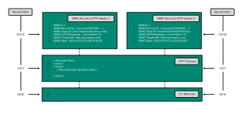
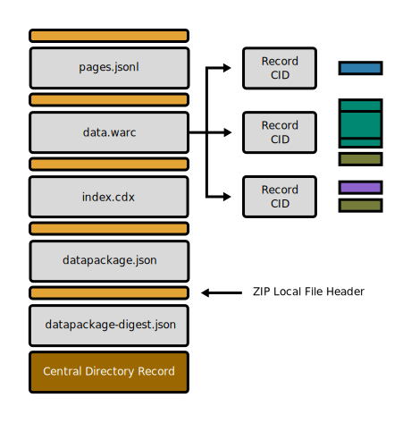

# IPFS Custom File Chunking for WARC and WACZ Formats Proposal (Draft)

## Abstract

This specification presents a specialized content-aware chunking strategy for adding composite web archive files (WARC and WACZ) to IPFS that maximizes content-based deduplication and is optimized for range-based access while producing a standard IPFS (UnixFS) file object.

The approach employs a 'bottom-up' method of splitting existing file formats into smaller, semantically significant
chunks. These chunks are then concatenated to form a standard UnixFS file [Directed Acyclic Graph](https://docs.ipfs.tech/concepts/merkle-dag/) (DAG) which maintains certain additional properties beneficial for access and deduplication, and preserves the integrity of the files involved when read from the root file identifier.

## Conformance

As well as sections marked as non-normative, all authoring guidelines, diagrams, examples, and notes in this specification are non-normative. Everything else in this specification is normative.
The key words MAY and MUST in this document are to be interpreted as described in BCP 14 [RFC2119][1] [RFC8174][2] when, and only when, they appear in all capitals, as shown here.

## Terminology

- IPFS
- UnixFS
- Content Addressing
- Chunking
- WACZ
- WARC

## Introduction

### Web Archive Formats (WARC and WACZ)

Web archiving data is often stored in specialized formats, which include a full record of the HTTP network traffic as well as additional metadata. The archived data is often accessed via random-access, loading the appropriate chunks of data based on URLs requested by end users.

This specification is designed to describe how to store two key file formats used for web archives:

1. WARC — A widely accepted [ISO standard](3) used by many institutions around the world for storing web archive data.

2. WACZ — A new format [developed by Webrecorder](4) for packaging WARCs with other web archive data.

Both formats are 'composite' formats, containing smaller amounts of data interspersed with metadata. In the case of WARC, the format consists of concatenated records which are appended one after the other, eg. `cat A.warc B.warc > C.warc`. The WARCs may or may not be gzipped, in which case the result is a multi-member gzip.

For this spec, such WARC files will be ungzipped as part of the chunking process.

WACZ files use the ZIP format which contains a specialized file and directory layout. ZIP is also a composite format, containing the raw (sometimes compressed) data as well as header data which contains the location files and directories within the ZIP file.

### Deduplication

One of the many challenges of web archiving is the vast amount of data that can be obtained when crawling the web. A lot of web content is ripe for deduplication where identical JavaScript files, fonts, images, and videos might be embedded within different pages. Ideally each resource loaded from the web while archiving would not need to be stored multiple times. Both the WARC and WACZ format can store duplicate data, but deduplication must be done via manual booking of duplicate content by digest.

### IPFS

One of the properties of IPFS is that it provides [content-addressable storage](https://docs.ipfs.tech/concepts/lifecycle/#_1-content-addressable-representation) where all data is split into small chunks, represented by
deterministic [Content Identifier (CID)](https://docs.ipfs.tech/concepts/content-addressing/#cids-are-not-file-hashes).

What this means is that given the same data, IPFS can store it the same way, so the same file added multiple times
in different places can result in the same CID and data.

The [UnixFS specification](https://github.com/ipfs/specs/blob/main/UNIXFS.md) allows for individual files to be "chunked" by separating continuous segments of the file's data into individual nodes in a Merkle DAG. These intermediate nodes are themselves encoded as UnixFS files.

### Custom Chunking

However, this default per-file chunking approach is not ideal for composite files, which may contain the same data at different positions.

For example, two WARC files may contain the same HTTP payload, but stored at different offsets. Using the 'naive' IPFS UnixFS chunking strategy this data will most likely be added multiple times and not deduplicated.

The strategy outlined here is to add the _contents_ of the WARC and WACZ files as individual IPFS (UnixFS) files, then concatenate them together to a form a larger file.

An interesting property of UnixFS is that larger files can be created by simply concatenating smaller files, without having to store the data multiple times, by creating a new link in the Merkle DAG. 

On a regular disk, running `cat A.warc B.warc > C.warc` will copy the data in `A.warc` and `B.warc` and store it into a new file, `C.warc`. The storage of `A.warc` and `B.warc` is duplicated to store `C.warc`.

#### IPFS Cat

Using UnixFS primitives in IPFS, we can define a new operation, `ipfs.cat` which can produce the equivalent of concatenated file without copying or duplicating the storage. If file `A.warc` and `B.warc` are both added to IPFS via standard `ipfs.add` operation, creating the equivalent of `C.warc` involve creating a new UnixFS intermediate DAG node.

This can be represented as `CID C = ipfs.cat(CID A, CID B)` where CID A and CID B are IPFS UnixFS files, and CID C is a new file, created as a new DAG root with CID A and CID B as children.

Reading the data associated with CID C will then yield the contents of both children as one continuous stream (which can be randomly accessed by offset).

This enables us to stitch together files while preserving their individual DAGs and enables deduplication of content in the same way as if those files were uploaded on their own.

The process involves:
- Splitting WACZ files, and WARC files inside of them by setting chunk boundaries according to their content, and adding each segment via `ipfs.add`.
- Concatenating WARC files at appropriate boundaries via `ipfs.cat`.
- Ensuring the ZIP file contains all files necessary for WACZ conformance, including WARC files.
- Concatenating individual files from at appropriate boundaries to form the containing ZIP file.

## WACZ and ZIP File Chunking

The [WACZ file format](https://specs.webrecorder.net/wacz/latest/) is an uncompressed [ZIP file](https://en.wikipedia.org/wiki/ZIP_(file_format)) with a particular directory structure, including WARC file for archival data, alongside extra files necessary for web archives.

### ZIP and Non-ZIP Directory

Since an uncompressed ZIP contains the byte-for-byte representation of all the files, it is possible to add
the files in a ZIP to IPFS as if they were a regular directory and file structure.
Then, an 'in place' ZIP can be created by concatenating the appropriate ZIP file headers in between the files
and a central directory record at the end.
In this way, the files are both in a ZIP and not in a ZIP, with different IPFS DAGs connecting the same data.
The diagram below illustrates how files can be added as a directory first, and then 'turned into a ZIP' by adding the appropriate ZIP data in between:

WACZ file chunking first involves chunking the contents of the ZIP as individual files.
Most files in the ZIP are added in the default way, however, special chunking approach is used for WARC files
to gain additional deduplication benefits when possible.

## WARC File Chunking

### Splitting WARC Files into Component Parts

WARC files are composed of concatenated series of WARC "records" — the basic components of the WARC format. 

The intent of our custom chunking strategy is first to split the WARC file at WARC record boundaries.
This will give each WARC record its own CID, which can be referred to and loaded independently in IPFS.
If there are duplicate WARC records found in a dataset, they will automatically only be added once.

### Uncompressed vs GZIP Records

WARC records are often individually gzip-ed when stored to reduce disk usage.
Unfortunately, this limits the amount of deduplication that is possible, as gzipped data is not easily lend itself to deduplication. 

Gzipped records can only be split at the WARC record boundaries.

However, if a record is stored uncompressed, additional split points are possible, before and after the record (usually HTTP) payload:

In the above example, CID A represents the possible split of an uncompressed record response-request record pair, while CID B represents two compressed records.

### Splitting Uncompressed WARC Records

If a WARC record is uncompressed (or is uncompressed at type of ingest into IPFS), we can insert additional
split points before and after the payload. This results in the WARC + HTTP headers, as well as the two newlines,
being stored in separate IPFS blocks (and having distinct CIDs as well)

The following example is a response record for `http://example.com`. The WARC record data and HTTP header are located in the first chunk, followed by the response payload, and the two newlines that signify the end of the record. 

If two different WARC `response` records created at different times, contain the same payload,
they can be automatically deduplicated across the IPFS network, as shown below:

Here, CID A and CID C point to the roots of two different IPFS dags, which represent each record. The records
contain a different headers (CID H1 and CID H2) but the same payload (CID P)

If the response for example.com is added later, even separate from any WARC, it too can be deduplicated against
previously added data.

### WARC Record Type Chunking

The WARC specification defines [eight different types of records](https://iipc.github.io/warc-specifications/specifications/warc-format/warc-1.0/#warc-record-types): 
1. warcinfo
2. response
3. resource
4. request
5. metadata
6. revisit
7. conversion
8. continuation

_Note: continuation records are rarely used and are not yet considered as part of this spec._

Similar to response / request, other WARC record types can be chunked in a similar way, with
the payload split into its own chunk if possible. Gzipped records should either be decompressed
or can only be split at record boundaries, as discussed above.

This diagram represents the seven different types of records with possible chunking approaches:

(Each colored box represents a WARC record type, lines within these boxes represent the ideal chunk boundaries.

### WARC File DAG

A WARC File DAG for multiple WARC records may appear as follows, with each response-request or other record pair
grouped together into its own sub-DAG and those CIDs concatenated together:

With this approach, individual record pairs can be re-combined to for new WARCs directly in IPFS, without
copying or moving any data. For example, selecting a subset of WARC record CIDs and concatenating
them together via the the same `ipfs.cat` operation will yield a new WARC with a subset of data.

## WACZ Chunking (ZIP + WARC chunking)

The full chunking of the WACZ file thus involves the split of the file along ZIP file boundaries, splitting of each WARC in the WACZ along WARC record (and possibly payload boundaries), and may look something like the following:

This approach allows for:
- deduplication of HTTP payload found in WARC records
- IPFS CID for each HTTP payload
- IPFS CID / DAG for each WARC record or record pair
- IPFS CID / DAG for each file in the WACZ
- IPFS CID / DAG for the WACZ directory structure
- IPFS CID / DAG for the zipped WACZ file.

## Algorithm

This algorithm is used for generating a UnixFS file tree for a single WACZ file which contains a webarchive.

This spec uses shorthands for referencing the UnixFS spec, and implementers should follow that spec in order to properly construct UnixFS Dag-PB blocks.
Shorthands are also used when referring to the ZIP file structure such as parsing out headers or the final directory block.
This spec relies on the existence of a blockstore to `put()` blocks of data into and get back the `cid` for the data.
This could be an on-disk or in-memory repo, or a streaming CAR file generation library.
This spec also relies on the existence of a `concat(root, ...files)`  which takes a set of IPFS `UnixFS.File` objects, takes their sizes and CIDs and adds them to an existing `IPFS.File` object.
As well, we assume that there is a way to `makeFile(bytes): UnixFS.File` which will take a stream of bytes and generate a UnixFS.File, either as a rawleaf block a file with a `data` property set to the file bytes, or a file with multiple `links` in it to subdags.
Your library should use the default chunking strategy from IPFS for `makeFile` and should have this configuration shared among your whole archive dataset to take advantage of deduplication.
One recommendation is to make use of `identity CIDs` for small chunks of data less than 32 bytes to reduce the number of DAG nodes by inlining the data within the CID itself.
Finally, we expect to have a `getByteSize(UnixFS.File)` function which will yield the size of the UnixFS.File's content.

TODO: Specify how to get a substream from the main zip file or whether to do parallelism

### `uploadWACZ(stream): UnixFS.File`

This method generates an IPFS UnixFS.File DAG from a stream representing a WACZ zip file.
Individual files in the ZIP get chunked as though they were standalone files and we use special chunking for WARC files.

- Create a `UnixFS.File` `zip` root.
- Iterate through each `zipChunk` of files in the ZIP file up until the `directory` at the end
  - Read just the `headers` from the chunk
  - `concat(zip, makeFile(headers))`
  - If the header identifies the file as something other than a `.warc` file
    - Get a stream for the actual `chunkFileContents`
    - `concat(zip, makeFile(chunkFileContents))`
  - Else if it is a `.warc` file
    - Get a stream for the actual `chunkFileContents`
    - `concat(zip, uploadWARC(chunkFileContents))`
- Take the entire `directory` at the end of the ZIP file as a byte stream
 - `concat(zip, makeFile(directory))`
- Return the new `ZIP` for it to be `put()` into a blockstore to get the root CID.

### uploadWARC(stream) : UnixFS.File

This method generates an IPFS UnixFS.FIle DAG from a stream representing a WARC file.
Individual records get split into their own sub DAGs to be remixed and response bodies get split into their own sub DAGs to deduplicate them across archives and responses.

- Create a `UnixFS.File` `warc` root
- Iterate through each WARC `recordChunk` as streams of bytes
	- Create a `UnixFS.File` `record`
	- Iterate through the request/response `headers`
	- If the `headers` are a `Response`, split out the `body` and the `header` prefix and the `suffix`
	  - `concat(record, makeFile(header), makeFile(body), makeFile(suffix))`
	- Else take the entire `header`
	  - `concat(record, makeFile(header)`
	- `concat(warc, record)`
- Return the `warc` to be either added to a WACZ file or to be uploaded on its own via `put()`

## Implementations

https://github.com/webrecorder/ipfs-composite-files#in-place-zip

https://github.com/webrecorder/awp-sw/blob/ed11bcecef16180236c752075011907ff88e40e1/src/ipfsutils.js#L463

Example implementation of UnixFS concat: https://github.com/anjor/unixfs-cat/blob/main/unixfs_cat.go#L12

[1]: https://www.rfc-editor.org/rfc/rfc2119
[2]: https://www.rfc-editor.org/rfc/rfc8174
[3]: https://iipc.github.io/warc-specifications/
[4]: https://specs.webrecorder.net/wacz/latest/

