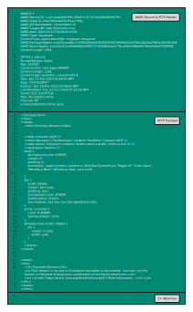

# IPFS Custom File Chunking for WARC and WACZ Formats

## Abstract

This specification presents a specialized content-aware chunking strategy for adding composite web archive files (WARC and WACZ) to IPFS in a way that maximizes content-based deduplication and optimized for range-based access while producing a standard IPFS (UnixFS) file object.

The approach employs a 'bottom-up' approach of splitting existing file formats into smaller, semantically significant
chunks, then concatenating to form a standard UnixFS file DAG which maintains certain additional properties
beneficial for access and deduplication, and preserving the integrity of the files involved when read from the root file identifier.

## Conformance

As well as sections marked as non-normative, all authoring guidelines, diagrams, examples, and notes in this specification are non-normative. Everything else in this specification is normative.
The key words MAY and MUST in this document are to be interpreted as described in BCP 14 [RFC2119][1] [RFC8174][2] when, and only when, they appear in all capitals, as shown here.

## Terminology

- IPFS
- UnixFS
- Content Addressing
- Chunking
- WACZ
- WARC

## Introduction

### Web Archive Formats (WARC and WACZ)

Web archiving data often stored in specialized formats, which include a full record of the HTTP network traffic
as well as additional metadata. The archived data is often accessed via random-access, loading the appropriate
chunk of data based on URL requests, etc..

This specification is designed to describe how to store two key file formats used for web archives:

- WARC - a widely used [ISO standard](3) used by many institutions around the world for storing web archive data.

- WACZ - A new format [developed by Webrecorder](4) for packaging WARCs with other web archive data.

Both formats are 'composite' formats, containing smaller amounts of data interspersed with metadata.
In the case of WARC, the format consists of concatenated records which are appended one after the other, eg.
`cat A.warc B.warc > C.warc`. The WARCs may or may not be gzipped, in which case the result is a multi-member gzip.
For this spec, such WARC files will be ungzipped as part of the process.

The WACZ format is a ZIP format which contains a specialized file and directory layout. The ZIP format is also a composite format, containing the raw (sometimes compressed) data as well as header data for how to find
files and directories within the ZIP

### Deduplication

One of the many challenges of web archiving is the vast amount of data that can be obtained when crawling the web.
A lot of web content is ripe for deduplication where JavaScript files, Fonts, Images, and Videos might be embedded within different pages. For a variety of reasons, this results in potentially duplicate data, which ideally, would not need to be stored multiple
times. Both the WARC and WACZ format can store duplicate data, but deduplication must be done via manual bookking of duplicate content by digest.

### Content-Addressable Storage

IPFS provides [Content-Addressable Storage]() which can automatically handle duplicate data - if the same data is added multiple times, it will be stored only once on each IPFS node.

To benefit from deduplication, the data must be added the same way. IPFS deals with large data sets by chunking
or splitting files into smaller blocks, using the UnixFS schema.

### UnixFS File Chunking

To take advantage of deduplication in IPFS, data needs to be added in exactly the same way. When adding large datasets,
IPFS split into smaller chunks, using equal sized chunks by default. 

The [UnixFS specification](https://github.com/ipfs/specs/blob/main/UNIXFS.md) allows for individual files to be "chunked" by separating continuous segments of the file's data into individual nodes in a Merkle DAG. These intermediate nodes are themselves encoded as UnixFS files.

By default, a large file is added to IPFS by splitting it into smaller, equal-sized chunks.

### Custom Chunking

Unfortunately, this approach is not ideal for composite files, which make contain the same data at different positions with a composite file.

For example, two WARC files may contain the same HTTP payload, but stored at different offsets. Using the 'naive' IPFS chunking strategy, this data will most likely be added multiple times and not deduplicated.

The strategy proposed here is to add the contents of the WARC and WACZ files as individual IPFS (UnixFS) files, then concatenate them together to a form a larger file.

The interesting property of UnixFS is that larger files can be created by simply concatenating smaller files, without having to store the data multiple times, by creating a new link in the Merkle DAG. 

On a regular disk, running `cat A.warc B.warc > C.warc` will copy the data in A.warc and B.warc and store it into
a new file, C.warc. The storage of `A.warc` adn `B.warc` is duplicated to store `C.warc`.

#### IPFS Cat

With IPFS, we can introduce a new operation, `ipfs.cat` which can produce the equivalent of concatenated
file without copying or duplicating the storage. If file `A.warc` and `B.warc` are both added to IPFS
via standard `ipfs.add` operation, 
creating the equivalent of `C.warc` involve creating a new UnixFS intermediate DAG node.

Readers of UnixFS files will automatically detect process UnixFS DAG, and a way to read the data as one continuous stream (which can be randomly accessed by offset).

This enables us to stitch together files while preserving their individual DAGs and being able to deduplicate content in the same way as if those files were uploaded on their own.

The process involves:
- Splitting WACZ files, and WARC inside of them in a custom way, and adding each segment via `ipfs.add`
- Concatenating WARC files at appropriate boundaries via `ipfs.cat`
- Ensuring the ZIP file contains all files necessary for WACZ conformance, including WARC
- Concatenating ZIP files from at appropriate boundaries to form the final ZIP file.

## WARC File Chunking

### Splitting WARC Files Into Component Parts

WARC files are composed of concatenated series of WARC "records", the basic components of the file format.  The WARC specification defines [eight different types of records](https://iipc.github.io/warc-specifications/specifications/warc-format/warc-1.0/#warc-record-types): 
1. warcinfo
2. response
3. resource
4. request
5. metadata
6. revisit
7. conversion
8. continuation

(Note: continuation records are rarely used and are not yet considered as part of this spec)

WARC files are often individually gzip-ed when stored on disk. To take advantage of this deduplication strategy, the WARC records must be ungzipped, relying on the compression at the IPFS storage level.

This diagram represents the seven different types of records with specific chunking instructions.  Each colored box represents a WARC record type, lines within these boxes represent the chunk boundaries.
<!-- ^ Should be a figcaption ^ -->

The following example is a response record for example.com.  The WARC record data and HTTP header are located in the first chunk, followed by the response payload, and the two newlines that signify the end of the record.  Resource and conversion records must also follow this format.

### WARC Chunking and the DAG

In addition to chunking the records according to their makeup, they are also grouped into individual UnixFS File DAGs so that they can effectively be recombined across archives at the UnixFS level.

The payloads are specifically split into their own DAG nodes so that their contents may be deduplicated across all archives and IPFS content.

In this diagram each colored box represents a WARC record type, lines within these boxes represent the chunk boundaries.  CIDs are assigned to pairs of related records or individual records depending on the record type.
<!-- ^ Should be a figcaption ^ -->

## WACZ File Chunking

The [ZIP file format](https://www.loc.gov/preservation/digital/formats/fdd/fdd000354.shtml) is used to create a single file which can contain several files within a directory structure. This allows files to be stored with compression, and in their raw uncompressed form as continuous segments of the file.

The WACZ file format is simply a ZIP file which contains WARC file for archival data, alongside extra files that aid in viewing the data. WACZ therefore uses a more generic approach to ZIP file chunking, generating regular UnixFS file nodes for the file chunks in the same way that they would be generated for any other file.

This diagram showcases a standard WACZ file's contents, separated by ZIP headers, and followed by the ZIP's Central Directory Record.  The WARC file that contains the web archive data is chunked as described in the previous section.
<!-- ^ Should be a figcaption ^ -->

Because UnixFS file DAGs can be nested indefinitely, the Merkle DAG for the WARC file is built up separately and embeded into the DAG of the ZIP file itself.

Once a WACZ file has been chunked, any resources that contain the same data within the archive (or within other archives) will get deduplicated at the storage / loading layer.

## Algorithm

This algorithm is used for generating a UnixFS file tree for a single WACZ file which contains a webarchive.

This spec uses shorthands for referencing the UnixFS spec, and implementers should follow that spec in order to properly construct UnixFS Dag-PB blocks.
Shorthands are also used when referring to the ZIP file structure such as parsing out headers or the final directory block.
This spec relies on the existence of a blockstore to `put()` blocks of data into and get back the `cid` for the data.
This could be an on-disk or in-memory repo, or a streaming CAR file generation library.
This spec also relies on the existence of a `concat(root, ...files)`  which takes a set of IPFS `UnixFS.File` objects, takes their sizes and CIDs and adds them to an existing `IPFS.File` object.
As well, we assume that there is a way to `makeFile(bytes): UnixFS.File` which will take a stream of bytes and generate a UnixFS.File, either as a rawleaf block a file with a `data` property set to the file bytes, or a file with multiple `links` in it to subdags.
Your library should use the default chunking strategy from IPFS for `makeFile` and should have this configuration shared among your whole archive dataset to take advantage of deduplication.
One recommendation is to make use of `identity CIDs` for small chunks of data less than 32 bytes to reduce the number of DAG nodes by inlining the data within the CID itself.
Finally, we expect to have a `getByteSize(UnixFS.File)` function which will yield the size of the UnixFS.File's content.

TODO: Specify how to get a substream from the main zip file or whether to do parallelism

### `uploadWACZ(stream): UnixFS.File`

This method generates an IPFS UnixFS.File DAG from a stream representing a WACZ zip file.
Individual files in the ZIP get chunked as though they were standalone files and we use special chunking for WARC files.

- Create a `UnixFS.File` `zip` root.
- Iterate through each `zipChunk` of files in the ZIP file up until the `directory` at the end
  - Read just the `headers` from the chunk
  - `concat(zip, makeFile(headers))`
  - If the header identifies the file as something other than a `.warc` file
    - Get a stream for the actual `chunkFileContents`
    - `concat(zip, makeFile(chunkFileContents))`
  - Else if it is a `.warc` file
    - Get a stream for the actual `chunkFileContents`
    - `concat(zip, uploadWARC(chunkFileContents))`
- Take the entire `directory` at the end of the ZIP file as a byte stream
 - `concat(zip, makeFile(directory))`
- Return the new `ZIP` for it to be `put()` into a blockstore to get the root CID.

### `uploadWARC(stream) : UnixFS.File

This method generates an IPFS UnixFS.FIle DAG from a stream representing a WARC file.
Individual records get split into their own sub DAGs to be remixed and response bodies get split into their own sub DAGs to deduplicate them across archives and responses.

- Create a `UnixFS.File` `warc` root
- Iterate through each WARC `recordChunk` as streams of bytes
	- Create a `UnixFS.File` `record`
	- Iterate through the request/response `headers`
	- If the `headers` are a `Response`, split out the `body` and the `header` prefix and the `suffix`
	  - `concat(record, makeFile(header), makeFile(body), makeFile(suffix))`
	- Else take the entire `header`
	  - `concat(record, makeFile(header)`
	- `concat(warc, record)`
- Return the `warc` to be either added to a WACZ file or to be uploaded on its own via `put()`

## Implementations

https://github.com/webrecorder/ipfs-composite-files#in-place-zip

https://github.com/webrecorder/awp-sw/blob/ed11bcecef16180236c752075011907ff88e40e1/src/ipfsutils.js#L463

Example implementation of UnixFS concat: https://github.com/anjor/unixfs-cat/blob/main/unixfs_cat.go#L12

[1]: https://www.rfc-editor.org/rfc/rfc2119
[2]: https://www.rfc-editor.org/rfc/rfc8174
[3]: https://iipc.github.io/warc-specifications/
[4]: https://specs.webrecorder.net/wacz/latest/

