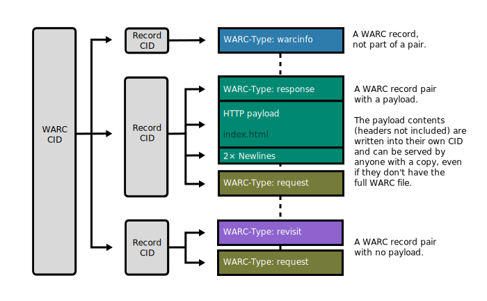

# WACZ/WARC on IPFS Spec

## Abstract

This specification details how WACZ/WARC files can be uploaded to IPFS using custom content-aware chunking strategies and the UnixFS standard. We do this by inspecting the boundaries inside a WACZ file for the individual archived pages and use that to form a UnixFS DAG when uploading an archive to IPFS.

## Conformance

As well as sections marked as non-normative, all authoring guidelines, diagrams, examples, and notes in this specification are non-normative. Everything else in this specification is normative.
The key words MAY and MUST in this document are to be interpreted as described in BCP 14 [RFC2119] [RFC8174] when, and only when, they appear in all capitals, as shown here.

## Terminology

- IPFS
- UnixFS
- Content Addressing
- Peer to Peer Networks: Software protocols for connecting people's computers directly together without a server acting as an intermediary.
- Chunking
- WACZ
- WARC

## Introduction

### Motivation

Web archiving is important for preserving cultural information and in order to add additional resilience to archives, they can be uploaded to peer to peer protocols (P2P) in order to make backup and retrieval more seamless.
Along with uploading content to be shared, P2P protocols enable us to interact with the data itself in new ways by changing the way archive files are stored on disk and transmitted across a network.
This specification formalizes what we learned and goes over the benefits of doing so.

### Deduplication

One of the advantages of using content addressable systems like IPFS is that datasets which contain the same data will de-duplicate storage for that data when within a larger dataset.
A lot of web content is ripe for deduplication where JavaScript files, Fonts, Images, and Videos might be embedded within different pages.
Typically, when storing archival datasets without content addressing, all of these resources will be doubled up on disk.

## UnixFS File Chunking

The [UnixFS specification](https://github.com/ipfs/specs/blob/main/UNIXFS.md) allows for individual files to be "chunked" by separating continuous segments of the file's data into individual nodes in a Merkle DAG. These intermediate nodes are themselves encoded as UnixFS files.

Readers of UnixFS files will automatically detect when a file has been chunked in this way, and will convert the UnixFS DAG to a representation where all the contents are treated as one continuous stream which can be randomly accessed at any index.

The interesting property here is that we can artificially create these chunked DAGs by concatenating preexisting UnixFS file nodes into one.

This enables us to stitch together files while preserving their individual DAGs and being able to deduplicate content in the same way as if those files were uploaded on their own.

The process involves uploading your raw files to their own UnixFS DAGs, getting the sizes of the individual files as well as the Content IDs (CID) for the data and then combining them in a UnixFS file via it's `Links` using the DAG-PB codec.

## ZIP File Chunking

The [ZIP file format](https://www.loc.gov/preservation/digital/formats/fdd/fdd000354.shtml) is used to create a single file which can contain several files within a directory structure. It allows files to be stored compressed and in their raw uncompressed form as continuous segments of the file.

We can combine this with our custom chunking code in order to chunk a ZIP file at it's file boundaries and generate regular UnixFS file nodes for the file chunks in the same way that they would be generated on their own.

TODO: Diagram showing file boundaries in a zip file, and chunk boundaries in a UnixFS Dag

## WARC File Chunking

WARC files contain a series of "Records" for loaded resources.

We group these records into individual UnixFS File DAGs so that they can more easily be recombined between archives at the UnixFS level.

TODO: Diagram of file with deliniation for records. The 'type' of record can be seen and the request and response records are grouped together (outline with a box?)

As well, we make sure to split out the response body into its own DAG node so that its contents may be deduplicated across all archives and IPFS content.

## WACZ File Chunking

The WACZ file format is based on the ZIP file format with the addition of a WARC file for archival data, and some extra files for viewing the data.

TODO: Diagram of directory structure within WACZ with the files usually added by WebRecorder tools

We take advantage of this by reading the metadata from the WACZ and WARC files and creating additional chunking boundaries at the boundaries of individual files within the WARC file.

TODO: Diagram of WACZ IPLD structure. Show ranges of zip files and the end directory structure, make boxes around IPLD boundaries with labels.

Due to how UnixFS file DAGs can be nested indefinitely, we can build up the Merkle DAG for the WARC file separately and embed it into the DAG of the ZIP file itself.

Once a file has been chunked, any resources that have the same data within the archive or within other archives will get deduplicated at the storage / loading layer.

## Algorithm

This algorithm is used for generating a UnixFS file tree for a single WACZ file which contains a webarchive.

This spec uses shorthands for referencing the UnixFS spec, and implementers should follow that spec in order to properly construct UnixFS Dag-PB blocks.
Shorthands are also used when referring to the ZIP file structure such as parsing out headers or the final directory block.
This spec relies on the existence of a blockstore to `put()` blocks of data into and get back the `cid` for the data.
This could be an on-disk or in-memory repo, or a streaming CAR file generation library.
This spec also relies on the existence of a `concat(root, ...files)`  which takes a set of IPFS `UnixFS.File` objects, takes their sizes and CIDs and adds them to an existing `IPFS.File` object.
As well, we assume that there is a way to `makeFile(bytes): UnixFS.File` which will take a stream of bytes and generate a UnixFS.File, either as a rawleaf block a file with a `data` property set to the file bytes, or a file with multiple `links` in it to subdags.
Your library should use the default chunking strategy from IPFS for `makeFile` and should have this configuration shared among your whole archive dataset to take advantage of deduplication.
One recommendation is to make use of `identity CIDs` for small chunks of data less than 32 bytes to reduce the number of DAG nodes by inlining the data within the CID itself.
Finally, we expect to have a `getByteSize(UnixFS.File)` function which will yield the size of the UnixFS.File's content.

TODO: Specify how to get a substream from the main zip file or whether to do parallelism

### `uploadWACZ(stream): UnixFS.File`

This method generates an IPFS UnixFS.File DAG from a stream representing a WACZ zip file.
Individual files in the ZIP get chunked as though they were standalone files and we use special chunking for WARC files.

- Create a `UnixFS.File` `zip` root.
- Iterate through each `zipChunk` of files in the ZIP file up until the `directory` at the end
  - Read just the `headers` from the chunk
  - `concat(zip, makeFile(headers))`
  - If the header identifies the file as something other than a `.warc` file
    - Get a stream for the actual `chunkFileContents`
    - `concat(zip, makeFile(chunkFileContents))`
  - Else if it is a `.warc` file
    - Get a stream for the actual `chunkFileContents`
    - `concat(zip, uploadWARC(chunkFileContents))`
- Take the entire `directory` at the end of the ZIP file as a byte stream
 - `concat(zip, makeFile(directory))`
- Return the new `ZIP` for it to be `put()` into a blockstore to get the root CID.

### `uploadWARC(stream) : UnixFS.File

This method generates an IPFS UnixFS.FIle DAG from a stream representing a WARC file.
Individual records get split into their own sub DAGs to be remixed and response bodies get split into their own sub DAGs to deduplicate them across archives and responses.

- Create a `UnixFS.File` `warc` root
- Iterate through each WARC `recordChunk` as streams of bytes
	- Create a `UnixFS.File` `record`
	- Iterate through the request/response `headers`
	- If the `headers` are a `Response`, split out the `body` and the `header` prefix and the `suffix`
	  - `concat(record, makeFile(header), makeFile(body), makeFile(suffix))`
	- Else take the entire `header`
	  - `concat(record, makeFile(header)`
	- `concat(warc, record)`
- Return the `warc` to be either added to a WACZ file or to be uploaded on its own via `put()`

## Implementations

https://github.com/webrecorder/ipfs-composite-files#in-place-zip

https://github.com/webrecorder/awp-sw/blob/ed11bcecef16180236c752075011907ff88e40e1/src/ipfsutils.js#L463

Example implementation of UnixFS concat: https://github.com/anjor/unixfs-cat/blob/main/unixfs_cat.go#L12
